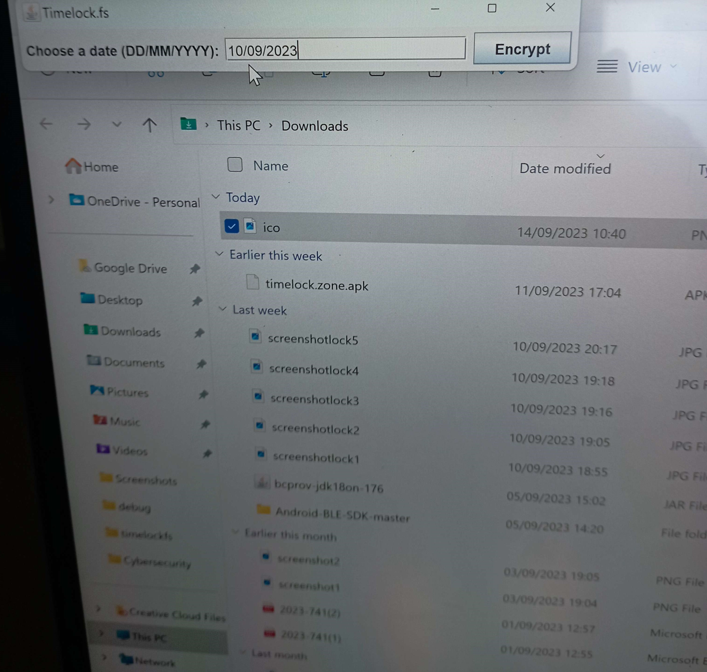

# timelock.fs
`timelock.fs` is an extension for the [timelock.zone](https://www.timelock.zone) service that enables to encrypt to the future and decrypts any file using Windows Explorer.
See also [tlcs-c](https://github.com/aragonzkresearch/tlcs-c/), [tlcs-rust](https://github.com/aragonzkresearch/tlcs-rust/), [Timelock.zone.AndroidExample](https://github.com/vincenzoiovino/Timelock.zone.AndroidExample) and [TLCS Usage](https://github.com/aragonzkresearch/tlcs-c/blob/main/examples/howtoencrypt.md).
## Installation
### Install from source
Add as dependencies ``bcprov-jdk15on-168.jar``, ``json-simple-1.1.jar`` and [``timelock.zone.jar``](https://github.com/vincenzoiovino/TimelockJavaAPI/tree/main).
Use `Java` tools or any IDE to build from the source code a runnable Jar file named `timelock.fs.jar` and stores it in the `bin` folder or in any other folder: the only requirement is that the files [`install.bat`](https://github.com/vincenzoiovino/timelock.fs/blob/main/bin/install.bat) and [`uninstall.bat`](https://github.com/vincenzoiovino/timelock.fs/blob/main/bin/uninstall.bat) must reside in the same folder as the runnable Jar you created.
Edit the file `install.bat` with any editor (e.g. Notepad) and change the line:
```bash
setx YOUR_JAVA "C:\Program Files\Java\jdk-15.0.2"
```
to:
```bash
setx YOUR_JAVA "Path"
```
where `Path` is a path to your Java Runtime Environment (`JRE`) installation you used for the compilation.
You can download JREs from [here](https://www.oracle.com/java/technologies/downloads/). Usually `Path` has the form `C:\Program Files\Java\jdk-XX.Y.Z`. If your `JRE` is installed correctly you should have a file `javaw.exe` under the folder `Path\bin`.
Once you edited the file `install.bat` as described before, you can run `install.bat`, grant admin permissions (needed to install the Windows extensions) and you are done.


Disclaimer: we used a very old version of `bouncycastle` for simplicity and we did not care about enforcing more stringent level of security for `ECIES`. This repo is only for testing `timelock.zone` functionalities. You can easy adapt all code to any `bouncycastle` version and different `ECIES` variant. 

### Install without compilation
Download the file [`timelock.fs.zip`](https://github.com/vincenzoiovino/timelock.fs/blob/main/timelock.fs.zip) and unzip it.  The so created folder `timelock.fs` contains (among others) a file named `install.bat`.
Download [JDK 17](https://jdk.java.net/archive/) or higher if you do not have `JDK`/`JRE` installed.
Run `install.bat`, grant admin permissions (needed to install the Windows extensions) and you are done.

#### Installation issues
The Jar `timelock.fs.jar` in the file `timelock.fs.zip` has been compiled with Java Runtime Environment (`JRE`) 17. If the installation does not work it is because you could have an older `JRE`. In such case, download `JRE` 17 (see above) and set `JAVA_HOME` environment variable to point to the new `JRE` folder. Another reason of installation failure could be that `JAVA_HOME` is not set at all, in such case set it to point to your `JRE` folder.

## Usage

### Encrypt to the future
You can right click on any file, e.g. `MyFile.pdf`, in Windows Explorer, select `Show more options` (this may depend on your Windows version) and then click on `timelock.fs.encrypt`.
You will be prompted to choose a date in the future in the format DD/MM/YYYY and an hour. Then you will just have to click on the `Encrypt` button. It will be created a file `MyFile.pdf.tlcs` that contains the encrypted version of the file `MyFile.pdf`. You can now delete the original file `MyFile.pdf` if you want to hide it until the chosen day.


### Decrypt
The encrypted file is protected until the day before the chosen date.
When the chosen day and hour is reached you can right click on the file `MyFile.pdf.tlcs`, select `Show more options` (this may depend on your Windows version) and then click on `timelock.fs.decrypt`. Your file will be decrypted and you will recover the file `MyFile.pdf`.

## Uninstall
To uninstall the `timelock.fs` extensions, run [`uninstall.bat`](https://github.com/vincenzoiovino/timelock.fs/blob/main/bin/uninstall.bat) (you must grant admin permissions) from the same folder where you launched `install.bat`.


## Screenshots
(The following screenshots refer to an older version.)

<br>

<br>

<br>

